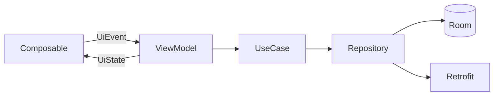

# Android Architecture

## Pattern: Clean Architecture + MVI

Each feature owns a vertical slice with three layers. Presentation uses **MVI**: unidirectional data flow from user events → ViewModel → `UiState` → Compose UI.



## Package structure

```text
com.stella/
├── StellaApplication.kt
├── app/
│   ├── MainActivity.kt
│   └── navigation/
│       ├── StellaNavHost.kt
│       └── Routes.kt
├── core/
│   ├── ui/
│   │   ├── theme/          # Color, Type, Theme
│   │   └── components/     # HabitGrid, TaskRow, etc.
│   ├── database/
│   │   ├── StellaDatabase.kt
│   │   ├── dao/
│   │   └── entity/
│   ├── network/
│   │   ├── StellaApi.kt
│   │   ├── dto/
│   │   └── ApiKeyInterceptor.kt
│   └── common/
│       ├── DispatcherModule.kt
│       └── Result.kt
├── feature/
│   ├── habits/
│   │   ├── presentation/
│   │   ├── domain/
│   │   └── data/
│   ├── tasks/
│   ├── calendar/
│   ├── morning/                   # MorningLockActivity
│   ├── dailyintent/               # DailyIntentActivity (planned tasks + blocks)
│   ├── nfc/                       # NfcEnrollmentActivity
│   ├── review/                    # Evening review (ReviewScreen)
│   ├── focus/                     # Phase 3
│   └── enforcement/               # Phase 3
└── sync/
    ├── SyncWorker.kt
    └── SyncRepository.kt
```

## MVI contract (per feature)

```kotlin
// Template — each feature defines its own types
data class HabitsUiState(
    val grid: HabitGridModel,
    val isLoading: Boolean = false,
    val error: String? = null,
)

sealed interface HabitsUiEvent {
    data class ToggleCheckIn(val habitId: String, val date: LocalDate) : HabitsUiEvent
    data object Refresh : HabitsUiEvent
}

// ViewModel
@HiltViewModel
class HabitsViewModel @Inject constructor(
    private val toggleCheckIn: ToggleHabitCheckInUseCase,
) : ViewModel() {

    private val _state = MutableStateFlow(HabitsUiState(...))
    val state: StateFlow<HabitsUiState> = _state.asStateFlow()

    fun onEvent(event: HabitsUiEvent) { /* reduce */ }
}
```

### Rules

- Composables are stateless; receive `state` and `onEvent` lambda.
- ViewModels never import Room or Retrofit types.
- One-off effects (snackbar, navigation) use `Channel`/`SharedFlow` side effects or Navigation callbacks.

## Layer responsibilities

| Layer | Contains | May depend on |
|-------|----------|---------------|
| `presentation` | Composable, ViewModel, UiState/Event | domain |
| `domain` | Use cases, repository interfaces, domain models | nothing Android-specific |
| `data` | Repository impl, DAO, DTO mappers | domain, core |

## Navigation

Single `MainActivity` hosts `StellaNavHost`:

| Route | Screen |
|-------|--------|
| `home` | Today summary |
| `habits` | Full habit grid |
| `tasks` | Frontline (task list + edit sheet) |
| `tasks?editTaskId={id}` | Frontline with edit sheet open |
| `calendar` | Temporal Grid (monthly) |
| `calendar?openDate={date}` | Temporal Grid with day sheet |
| `review` | Evening review form + habit snapshot |
| `settings` | Settings hub (timezone, schedule defaults) |
| `settings/advanced` | API credentials, NFC enrollment |
| `settings/diagnostics` | Dev triggers, sync, purge |

Enforcement screens (morning lock, task takeover) may use separate `Activity` entries for full-screen/intent reliability — see [../android/permissions-and-apis.md](../android/permissions-and-apis.md).

## Dependency injection (Hilt)

| Module | Provides |
|--------|----------|
| `DatabaseModule` | `StellaDatabase`, DAOs |
| `NetworkModule` | `Retrofit`, `StellaApi` |
| `RepositoryModule` | Repository bindings |
| `DispatcherModule` | `@IoDispatcher`, `@MainDispatcher` |

## Core components by phase

| Phase | Components |
|-------|------------|
| 1 | Room, NavHost, Habits/Tasks/Calendar MVI, SyncWorker |
| 2 | `MorningLockActivity`, `MorningLockSetupActivity`, `MorningLockEnforcementService`, `MorningAlarmScheduler`, `DailyIntentActivity`, `NfcEnrollmentActivity`, `ReviewScreen`, `LifeLogWriter`, `EveningReviewScheduler` |
| 3 | `TaskTakeoverActivity`, `AlarmReceiver`, `FocusForegroundService`, FCM service |

## Testing strategy

- **Domain:** JVM tests for use cases with fake repositories.
- **Presentation:** ViewModel tests with Turbine on `StateFlow`.
- **UI:** Compose tests for `HabitGrid` cell colors and morning gate screens.

## Related

- [sync.md](sync.md)
- [../design/design-system.md](../design/design-system.md)
- [../android/permissions-and-apis.md](../android/permissions-and-apis.md)
