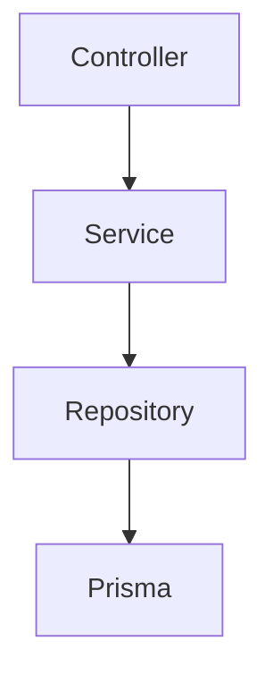

# Backend Architecture

NestJS API deployed on a GCP VM, persisting to MongoDB Atlas via Prisma.

## Module layout

```text
server/src/
├── main.ts
├── app.module.ts
├── common/
│   ├── guards/api-key.guard.ts
│   ├── filters/http-exception.filter.ts
│   └── prisma/
│       └── prisma.service.ts
├── habits/
│   ├── habits.module.ts
│   ├── habits.controller.ts
│   ├── habits.service.ts
│   └── habits.repository.ts
├── tasks/
├── calendar/
│   ├── calendar.module.ts        # events CRUD
│   └── ...
├── life-logs/
├── sync/
│   ├── sync.controller.ts
│   └── sync.service.ts
├── daily-intents/                # Phase 2
├── evening-reviews/              # Phase 2
├── notifications/                # Phase 3 — FCM
└── ai/                           # later — OpenAI cron
```

## Layering (per module)



| Layer | Role |
|-------|------|
| **Controller** | HTTP mapping, DTO validation (`class-validator`), status codes |
| **Service** | Business rules, orchestration (use case) |
| **Repository** | Prisma queries, mapping to domain types |
| **Prisma** | Generated client from `schema.prisma` |

Controllers stay thin; no Prisma calls in controllers.

## Global concerns

### Authentication

All `/api/v1/*` routes use `ApiKeyGuard` comparing header `X-Api-Key` to `process.env.API_KEY`.

### Validation

- DTOs with `class-validator` + `ValidationPipe` (whitelist, forbidNonWhitelisted)
- UUID format for entity ids

### Errors

```json
{
  "code": "HABIT_NOT_FOUND",
  "message": "Habit with id ... not found"
}
```

Map Nest `HttpException` through a global filter for consistent shape.

## Domain modules

| Module | Phase | Responsibility |
|--------|-------|----------------|
| `habits` | 1 | Habit CRUD, check-in upserts |
| `tasks` | 1 | Task CRUD |
| `calendar` | 1 | Calendar event CRUD |
| `sync` | 1 | Bulk push/pull |
| `daily-intents` | 2 | Morning Top 3 persistence |
| `evening-reviews` | 2 | Evening review + snapshot |
| `life-logs` | 2 | Append-only life events |
| `notifications` | 3 | FCM send, device token store |
| `ai` | later | Cron → OpenAI → notification |

## Prisma + MongoDB

- Single database, collections per model in `schema.prisma`
- Use `@db.ObjectId` or `String @id` with UUID — **prefer String UUID** matching Android client ids for simpler sync
- Index on `updatedAt` for sync pull queries

## Scheduled jobs (Phase 3+)

| Job | Schedule | Action |
|-----|----------|--------|
| Task reminder | Per-task (or pre-computed) | FCM high-priority data message |
| Evening evaluation | 20:00 user TZ | OpenAI summary → push (later) |

Use `@nestjs/schedule` on the VM process.

## Local development

```bash
cd server
cp .env.example .env
npm install
npx prisma db push      # dev only
npm run start:dev
```

## Deployment

See [../deployment.md](../deployment.md). API listens on internal port; nginx terminates TLS.

## Related

- [sync.md](sync.md)
- [../api/rest-api.md](../api/rest-api.md)
- [../data-model.md](../data-model.md)
