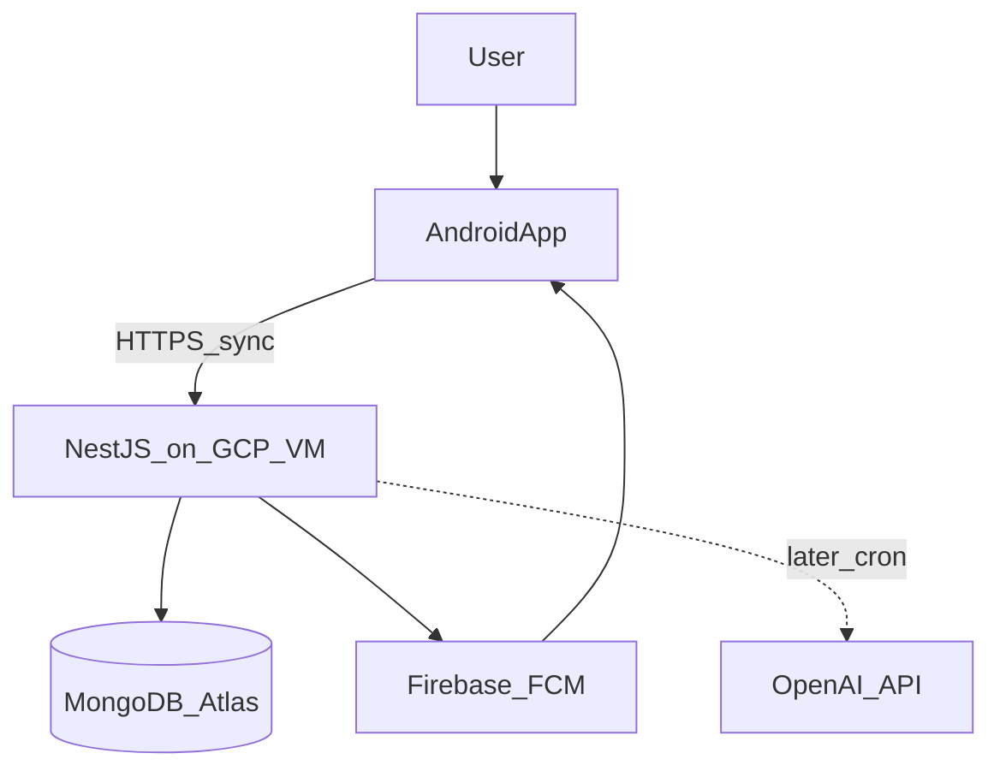

# System Architecture Overview

## Context (C4 Level 1)

Stella serves a **single user** on one Android phone. The phone enforces routines locally; the server provides backup, sync, push (Phase 3), and future AI coaching.

## Containers (C4 Level 2)

| Container | Responsibility |
|-----------|----------------|
| **Android app** | UI, MVI state, enforcement (overlay, alarms, NFC), Room persistence, sync worker |
| **NestJS API** | Validation, persistence to Atlas, sync merge, FCM send, cron jobs |
| **MongoDB Atlas** | Durable documents, backup, future multi-device |
| **Firebase** | Push delivery (Phase 3) |

## Data flow principles

1. **Offline-first:** User actions write to Room immediately; sync is asynchronous.
2. **Enforcement is local:** Morning lock and alarms must work without network.
3. **Server is backup + orchestration:** Not required for core daily loop except sync/AI/push.

## Cross-cutting concerns

| Concern | Approach |
|---------|----------|
| Identity | Single API key (solo v1) |
| Time | Store UTC; display local on device |
| Idempotency | Entity `id` (UUID) on all upserts |
| Conflicts | Last-write-wins by `updatedAt` — [sync.md](sync.md) |
| Logging | Android: Logcat tags per feature; Server: structured JSON logs |

## Phase mapping

| Phase | Containers touched |
|-------|-------------------|
| 1 | Android CRUD + Room; API CRUD + sync |
| 2 | Android overlay/NFC; API daily-intent + evening-review |
| 3 | Android alarms/FCM receiver; API notifications module |

## Risks and mitigations

| Risk | Impact | Mitigation |
|------|--------|------------|
| Overlay permission denied | Morning lock fails | Dedicated settings checklist; block "day start" until granted |
| Exact alarm permission denied (API 31+) | Task reminders drift | `SCHEDULE_EXACT_ALARM`; education screen; in-app alarm fallback |
| OEM battery optimization | Alarms killed | Foreground service for focus; prompt to disable battery restrictions |
| NFC tag lost | Cannot unlock morning | Re-register tag in Settings; keep spare physical tag |
| Play Store overlay policy | Cannot publish easily | Solo sideload; revisit if going public |
| Atlas connectivity | Sync fails | Queue pushes in Room; retry via WorkManager |
| VM downtime | No sync/push | App remains fully usable offline |

## Related documents

- [android.md](android.md) — client structure
- [backend.md](backend.md) — server structure
- [sync.md](sync.md) — sync protocol
- [../deployment.md](../deployment.md) — infrastructure
