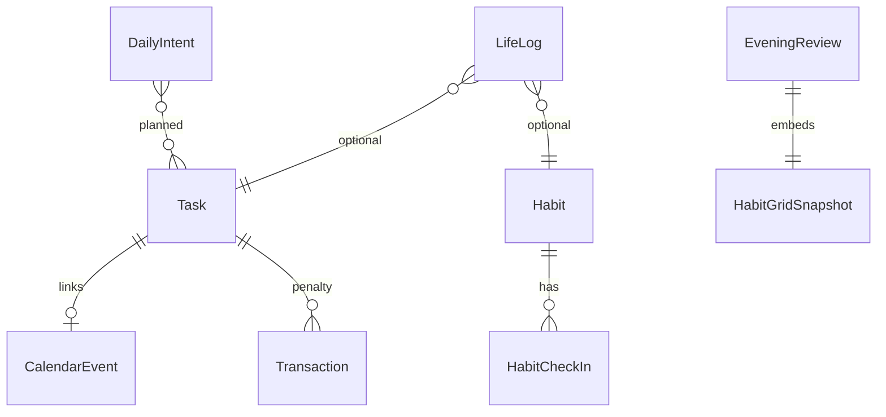

# Data Model

Entities are stored in **Room** (Android) and **MongoDB** (server) with matching field names. All syncable entities use **String UUID** primary keys.

## Entity relationship diagram



## Habit

| Field | Type | Required | Notes |
|-------|------|----------|-------|
| `id` | UUID string | yes | Client-generated |
| `name` | string | yes | Display name |
| `sortOrder` | int | yes | Grid row order |
| `active` | boolean | yes | Inactive hidden from grid |
| `createdAt` | ISO-8601 | yes | |
| `updatedAt` | ISO-8601 | yes | Sync |
| `deletedAt` | ISO-8601 | no | Soft delete |

## HabitCheckIn

One record per habit per calendar day.

| Field | Type | Required | Notes |
|-------|------|----------|-------|
| `id` | UUID string | yes | |
| `habitId` | UUID string | yes | FK → Habit |
| `date` | string | yes | `YYYY-MM-DD` (local calendar date) |
| `status` | enum | yes | `DONE` \| `MISSED` |
| `updatedAt` | ISO-8601 | yes | |

**Unique constraint:** `(habitId, date)`

### Habit grid (derived)

- **Rows:** active habits ordered by `sortOrder`
- **Columns:** days in visible window (default: current week Mon–Sun)
- **Cell color:** `DONE` → green, `MISSED` → red, no check-in for past days → red (auto-missed at day boundary), future → empty/dark surface (not gray "neutral")

## Task

| Field | Type | Required | Notes |
|-------|------|----------|-------|
| `id` | UUID string | yes | |
| `title` | string | yes | |
| `notes` | string | no | |
| `scheduledAt` | ISO-8601 | no | Triggers Phase 3 alarm |
| `durationMinutes` | int | no | Focus session default |
| `status` | enum | yes | `TODO` \| `IN_PROGRESS` \| `DONE` \| `SKIPPED` |
| `priority` | enum | no | `LOW` \| `MEDIUM` \| `HIGH` |
| `createdAt` | ISO-8601 | yes | |
| `updatedAt` | ISO-8601 | yes | |
| `deletedAt` | ISO-8601 | no | |

## CalendarEvent

Stella-owned calendar only (no external sync).

| Field | Type | Required | Notes |
|-------|------|----------|-------|
| `id` | UUID string | yes | |
| `title` | string | yes | |
| `startAt` | ISO-8601 | yes | |
| `endAt` | ISO-8601 | yes | |
| `linkedTaskId` | UUID string | no | |
| `recurrenceRuleJson` | string (JSON) | no | `RecurrenceRule` (NONE, DAILY, WEEKLY, MONTHLY, YEARLY, CUSTOM) |
| `reminderOffsetsJson` | string (JSON) | no | Minutes before start, e.g. `[0, 15, 1440]` |
| `createdAt` | ISO-8601 | yes | |
| `updatedAt` | ISO-8601 | yes | |
| `deletedAt` | ISO-8601 | no | |

## DailyIntent (Phase 2)

| Field | Type | Required | Notes |
|-------|------|----------|-------|
| `id` | UUID string | yes | |
| `date` | string | yes | `YYYY-MM-DD` |
| `plannedTaskIds` | string[] | yes | Min 3 task ids; no maximum |
| `completedAt` | ISO-8601 | yes | Morning unlock timestamp |
| `nfcTagId` | string | yes | Scanned tag identifier |
| `updatedAt` | ISO-8601 | yes | |

**Unique constraint:** `date` (one intent per day)

## EveningReview (Phase 2)

| Field | Type | Required | Notes |
|-------|------|----------|-------|
| `id` | UUID string | yes | |
| `date` | string | yes | `YYYY-MM-DD` |
| `plannedVsActual` | string | no | Structured text (what planned vs did) |
| `reflectionText` | string | no | Free-form reflection |
| `habitGridSnapshot` | object | yes | JSON snapshot of grid state |
| `completedAt` | ISO-8601 | yes | |
| `updatedAt` | ISO-8601 | yes | |

### habitGridSnapshot shape

```json
{
  "weekStart": "2026-05-12",
  "cells": [
    { "habitId": "...", "date": "2026-05-12", "status": "DONE" }
  ]
}
```

## LifeLog

Append-heavy audit trail for searchable history.

| Field | Type | Required | Notes |
|-------|------|----------|-------|
| `id` | UUID string | yes | |
| `type` | enum | yes | See below |
| `payload` | JSON object | yes | Type-specific |
| `timestamp` | ISO-8601 | yes | |
| `updatedAt` | ISO-8601 | yes | |

### LifeLog types

| Type | payload example |
|------|-----------------|
| `MORNING_UNLOCK` | `{ dailyIntentId, nfcTagId }` |
| `TASK_STARTED` | `{ taskId }` |
| `TASK_SKIPPED` | `{ taskId, reason }` |
| `HABIT_CHECKIN` | `{ habitId, date, status }` |
| `EVENING_REVIEW` | `{ eveningReviewId }` |
| `SYNC` | `{ direction, counts }` |
| `PENALTY_CHARGED` | `{ taskId, amountCents }` (planned) |

## Transaction

Single-entry cash-flow ledger (ingress/egress).

| Field | Type | Required | Notes |
|-------|------|----------|-------|
| `id` | UUID string | yes | |
| `type` | enum | yes | `ingress` \| `egress` |
| `amount` | number | yes | |
| `category` | string | yes | e.g. Salary, Food, Penalty |
| `description` | string | no | |
| `date` | ISO-8601 | yes | |
| `linkedTaskId` | UUID string | no | Penalty link |
| `createdAt` | ISO-8601 | yes | |
| `updatedAt` | ISO-8601 | yes | |
| `deletedAt` | ISO-8601 | no | |

## Debt

| Field | Type | Required | Notes |
|-------|------|----------|-------|
| `id` | UUID string | yes | |
| `contactName` | string | yes | |
| `direction` | enum | yes | `owed_to_me` \| `owed_by_me` |
| `totalAmount` | number | yes | |
| `remainingAmount` | number | yes | |
| `dueDate` | ISO-8601 | no | |
| `notes` | string | no | |
| `isResolved` | boolean | yes | |
| `createdAt` | ISO-8601 | yes | |
| `updatedAt` | ISO-8601 | yes | |
| `deletedAt` | ISO-8601 | no | |

## SyncMeta (Room only)

| Field | Type | Notes |
|-------|------|-------|
| `deviceId` | UUID string | Created on first launch |
| `lastPushedAt` | ISO-8601 | nullable |
| `lastPulledAt` | ISO-8601 | nullable |

## Server-only (Phase 3)

### DeviceToken

| Field | Type | Notes |
|-------|------|-------|
| `deviceId` | string | |
| `fcmToken` | string | |
| `updatedAt` | ISO-8601 | |

## Server persistence (Mongoose)

Schemas live in `server/src/database/schemas/`. MongoDB collection names match prior Prisma defaults:

| Model | Collection |
|-------|------------|
| Habit | `Habit` |
| HabitCheckIn | `HabitCheckIn` |
| Task | `Task` |
| CalendarEvent | `CalendarEvent` |
| DailyIntent | `DailyIntent` |
| EveningReview | `EveningReview` |
| LifeLog | `LifeLog` |
| DeviceToken | `DeviceToken` |
| Transaction | `Transaction` |
| Debt | `Debt` |

- `_id`: String UUID (same value as API `id`)
- `habitGridSnapshot` / `payload`: `Schema.Types.Mixed`
- Explicit `createdAt` / `updatedAt` (no Mongoose timestamps)

## Room database

- Database name: `stella.db`
- Version: **8** (includes `transactions`, `debts` tables)
- Versioning: destructive migration until explicit migrations land
- All entities include `needsSync: Boolean` default `true` on local mutation (cleared after successful push)

## Related

- [api/rest-api.md](api/rest-api.md)
- [architecture/sync.md](architecture/sync.md)
- [adr/007-mongoose-orm.md](adr/007-mongoose-orm.md)
