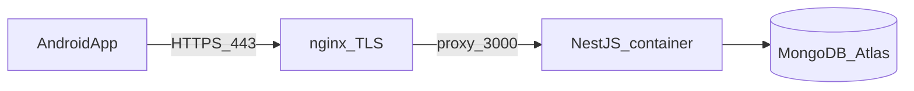

# Deployment

Stella runs as a **Dockerized NestJS API** on a **GCP VM**, with **MongoDB Atlas** as the managed database. Android connects over HTTPS.

## Architecture



## MongoDB Atlas

1. Create cluster (M0 free tier OK for solo dev; M10 for production).
2. Database user with read/write on `stella` database.
3. Network access: allow GCP VM **static egress IP** (or `0.0.0.0/0` temporarily for dev only).
4. Connection string format:

```text
mongodb+srv://<user>:<password>@<cluster>.mongodb.net/stella?retryWrites=true&w=majority
```

Store as `DATABASE_URL` in server environment (Prisma accepts MongoDB URL).

## GCP VM setup

| Spec | Recommendation |
|------|----------------|
| OS | Ubuntu 22.04 LTS |
| Machine | e2-small (solo) |
| Disk | 20 GB |
| Static IP | Reserve external IP for DNS + Atlas allowlist |

### Initial server steps

```bash
# On VM
sudo apt update && sudo apt install -y docker.io docker-compose-plugin
sudo usermod -aG docker $USER
```

Clone repository, configure `server/.env`, run via `infra/docker-compose.yml` (see below).

## Docker Compose (infra/)

```yaml
# infra/docker-compose.yml (reference)
services:
  api:
    build: ../server
    env_file: ../server/.env
    restart: unless-stopped
    ports:
      - "127.0.0.1:3000:3000"

  nginx:
    image: nginx:alpine
    ports:
      - "80:80"
      - "443:443"
    volumes:
      - ./nginx.conf:/etc/nginx/nginx.conf:ro
      - /etc/letsencrypt:/etc/letsencrypt:ro
    depends_on:
      - api
```

## TLS (Let's Encrypt)

```bash
sudo apt install certbot python3-certbot-nginx
sudo certbot --nginx -d api.yourdomain.com
```

Nginx terminates TLS and proxies to `http://127.0.0.1:3000`.

## Environment variables

### Server (`server/.env`)

| Variable | Required | Description |
|----------|----------|-------------|
| `DATABASE_URL` | yes | MongoDB Atlas connection string |
| `API_KEY` | yes | Long random string for `X-Api-Key` |
| `PORT` | no | Default `3000` |
| `NODE_ENV` | no | `production` |
| `FCM_SERVICE_ACCOUNT_JSON` | Phase 3 | Firebase service account (path or base64) |
| `OPENAI_API_KEY` | later | Evening AI job |

### Root `.env.example`

Template at repo root — copy to `server/.env`, never commit real values.

## Android configuration

| Build | Config |
|-------|--------|
| Debug | `BuildConfig.API_BASE_URL` → `http://10.0.2.2:3000` (emulator) or LAN IP |
| Release | `https://api.yourdomain.com` |

API key: entered in Settings UI, stored in `EncryptedSharedPreferences`.

## Deploy procedure

1. Push code to VM (`git pull` or CI deploy).
2. `cd server && npm ci && npx prisma generate && npm run build`
3. `docker compose -f infra/docker-compose.yml up -d --build`
4. Verify: `curl -H "X-Api-Key: $KEY" https://api.yourdomain.com/api/v1/habits`

## Database migrations

Prisma for MongoDB:

```bash
npx prisma db push    # dev
# production: review schema changes; db push or migrate when available
```

## Monitoring (minimal solo setup)

- `docker compose logs -f api`
- Atlas metrics dashboard for connections/storage
- Optional: UptimeRobot HTTP check on `/api/v1/habits` with API key

## Backup

- Atlas automated backups (enable on cluster)
- Export habits/tasks periodically via sync pull script (optional)

## Security checklist

- [ ] API key ≥ 32 random bytes
- [ ] Atlas IP allowlist restricted to VM IP
- [ ] TLS only in production
- [ ] SSH key-only access to VM
- [ ] Firewall: allow 22 (SSH), 80, 443 only
- [ ] No secrets in git

## Related

- [stack.md](stack.md)
- [api/rest-api.md](api/rest-api.md)
