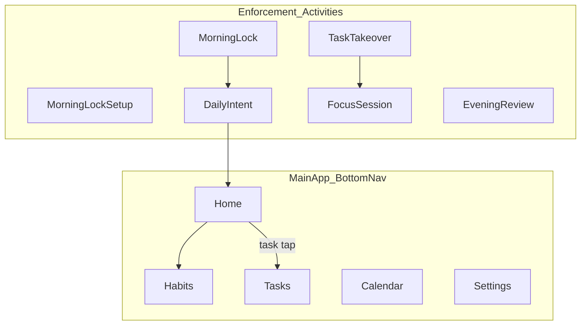

# Screen Inventory

All screens use dark theme per [design-system.md](design-system.md). Navigation via bottom bar (main app) or full-screen `Activity` (enforcement).

## Navigation map

---

## 1. Home (Control Center)

**Route:** `home`

Dawn-gradient dashboard (same tokens as Morning Lock / Daily Intent). Title **Control Center** — bold `headlineLarge`, no coach eyebrow.

| Area | Content |
|------|---------|
| Header | "Control Center" |
| Clock | Live `HH:mm:ss` + AM/PM (monospace); date line `EEEE, MMMM d` |
| Week strip | Sun–Sat of current calendar week; tap selects day; today = orange pill |
| Metrics | Completion ring (% done for selected day) + active task count card |
| Section | **Tasks in Progress** — non-done tasks for selected day (`IN_PROGRESS` first); status icon per row |
| Banner | Evening review prompt (dawn panel) when threshold met |
| Actions | Low-profile outlined **Matrix** / **Frontline** (habits + tasks) |

**Day scope:** Tasks for metrics/list = union of that day's `plannedTaskIds` (daily intent) + tasks with `scheduledAt` on that date.

**Actions:** Week day tap → filter metrics/list; task row → Frontline (edit sheet); Matrix → Habits; Frontline → Tasks; drawer unchanged.

---

## 2. Habits (Discipline)

**Route:** `habits`

Dawn-gradient screen below global top bar. Eyebrow **DISCIPLINE**, title **Habits**, orange **+** for create.

| Area | Content |
|------|---------|
| Header | DISCIPLINE + Habits + add icon |
| Week nav | `MMM d – MMM d` with chevrons (Mon–Sun week) |
| Grid headers | Single letters **M T W T F S S** — no horizontal scroll |
| Rows | Habit name (tap → edit sheet) + 7 equal-width day cells |
| Cells | Incomplete: subtle `DawnCardSurface` square; Done: emerald + check; Today: orange ring |
| Sheets | Create habit (bottom sheet); Edit (rename + delete with trash icon) |
| Tooltip | Long-press completed cell → `Completed on May 18 at 8:30 AM` |

**Actions:** Tap cell → toggle done (stores `completedAt`); tap again clears; tap name → edit sheet; + → create sheet.

---

## 3. The Frontline (Operations)

**Route:** `tasks`

Dawn-gradient screen. Eyebrow **OPERATIONS**, title **The Frontline**.

| Area | Content |
|------|---------|
| Composer | Collapsible “New directive” panel; expanded: title field + **Today** / **Tomorrow** chips (each opens schedule sheet) |
| Schedule sheet | Glass bottom sheet: day chevrons + hour/minute dropdowns; **Add directive** on create; **Save** + optional delete on edit |
| Tabs | **Today** \| **Tomorrow** \| **All Sequences** (orange underline on active) |
| Active list | Reorderable cards: drag handle + `01` badge + title + time chip + checkbox + delete |
| Time chip | Human-readable, e.g. `Today • 9:00 AM`, `Tomorrow • 2:30 PM` |
| Completed | Separate section at bottom; strikethrough; not draggable; uncheck restores to active queue |

**Sequence:** Global `sortOrder` on active tasks; drag in a tab reorders visible slice locally during drag, persists once on release. Completed tasks excluded from sequence.

**Actions:** Add directive (pick date/time), tap card to edit name/schedule, toggle status, delete, drag reorder.

**Settings (time):** Single **Default task start time** (replaces Frog 1/2/3 defaults); used for new Frontline directives and Daily Intent block stagger base.

---

## 4. Temporal Grid (Calendar)

**Route:** `calendar` (optional `?openDate=YYYY-MM-DD` from reminder deep link)

Dawn-gradient screen. Eyebrow **TEMPORAL**, title **Temporal Grid**.

| Area | Content |
|------|---------|
| Month nav | Chevron month/year header |
| Grid | Borderless 7-column month; today = orange glow circle |
| Status dots | Green = completions (habits/tasks); orange = scheduled events; blue = linked-task events |
| Day sheet | Tap day → bottom sheet: **Completed Activities** (timestamped), **Scheduled Events** (tap to edit), **Add event** |
| Event editor | Title, start/end date-time steppers, repeat presets (incl. yearly/custom), reminder chips, delete on edit |

No static event list on the main screen.

---

## 6. Morning lock (Phase 2)

**Activity:** `MorningLockActivity` (full-screen, edge-to-edge overlay)  
**Compose:** `MorningLockScreen`, `NfcScanPulse`

| Area | Content |
|------|---------|
| Background | Vertical dawn gradient: `MorningLockGradientTop` → `MorningLockGradientBottom` |
| Header | Eyebrow `StellaLabel` — "Morning lock"; hero **Rise & Shine** (`headlineLarge`, bold, no italic) |
| Center | `NfcScanPulse` — three staggered radiating rings + outlined NFC icon (~2.4s loop) |
| Instruction | Default: "Scan your bathroom tag to start the day."; errors in `Error` (wrong tag, no enrollment) |
| Footer | **Production:** no skip control. **Debug:** `Skip NFC (Debug)` text link @ ~40% `TextMuted` opacity |

Blocks all other interaction until NFC success. Back navigation disabled.

---

## 7. Daily intent (Phase 2)

**Route/Activity:** after NFC → `DailyIntentActivity` / `DailyIntentScreen`

Single viewport (no page scroll). Dawn gradient matches Morning Lock.

| Area | Content |
|------|---------|
| Background | `DawnGradientTop` → `DawnGradientBottom` |
| Header | Title "Daily Intent"; subtitle `Add at least 3 tasks for today (n/3)`; info icon (timezone, block length, per-task times) |
| Today's plan | Compact scrollable list of planned tasks (title + remove); no Task 1/2/3 slots |
| Search | Unified field: "Search or create a task…" — filters list; `Create "…"` row when no match; tap adds to plan |
| Task list | Fixed-height `LazyColumn` (`weight(1f)`) — only this region scrolls |
| CTA | `Start My Day` gradient button — enabled when `n >= 3` (unlimited max) |

Per-task calendar start times: edited in info bottom sheet (one row per planned task). Blocks created on submit for all planned tasks.

Persist `plannedTaskIds` (array, min 3, no max).

On submit: persist `DailyIntent`, calendar events, write `LifeLog`, navigate to main app.

---

## 8. Focus session (Phase 3)

**Activity:** `FocusSessionActivity`

| Area | Content |
|------|---------|
| Center | Monospace countdown |
| Subtitle | Task title |
| Bottom | Pause (discouraged), Complete early |

Foreground notification while running.

---

## 9. Task takeover (Phase 3)

**Activity:** `TaskTakeoverActivity`

| Area | Content |
|------|---------|
| Full screen | `FullScreenTakeover` component |
| Alarm | Repeats every 2 min until action |

Actions: Start Focus → Focus session; Snooze (max 2×, 5 min).

---

## 10. Evening review (Phase 2)

**Route:** `evening-review` (also prompt at configured time)

| Area | Content |
|------|---------|
| Form | `EveningReviewForm` |
| Grid | Read-only week snapshot |
| CTA | "Close the day" |

Triggers sync push on save.

---

## 11. Settings (three-screen hub)

**Routes:** `settings` (graph) → `settings/main` | `settings/advanced` | `settings/diagnostics`

### 11a. Main Settings (`USER CONFIG`)

| Group | Items |
|-------|-------|
| Timezone | Searchable IANA picker; **Use device timezone** toggle |
| Schedule & block defaults | Block duration slider; default task start time chip; evening review reminder chip; Save |
| Navigation | Advanced Developer Options; Testing & Diagnostics Hub |

### 11b. Developer Options (`SYSTEM`)

| Group | Items |
|-------|-------|
| Server | API endpoint URL, API key (masked), Save credentials |
| NFC hardware | Registered tag ID; **Register New NFC Tag** → `NfcEnrollmentActivity` |

### 11c. Diagnostics Console (`DEVELOPER`)

| Trigger | Action |
|---------|--------|
| Simulate Morning Lock | Opens `MorningLockActivity` |
| Trigger Test Notification | Local diagnostics notification |
| Simulate Daily Reset | Clears today's daily intent + evening review |
| Ping API Connection | `GET /api/v1/health` |
| Log Test Penalty | Creates local egress `Penalty` transaction |
| Sync now / Purge local | Dev data utilities |

---

## 7. Finances (Treasury)

| Area | Component |
|------|-----------|
| Summary | Monthly net (green/red), ingress vs egress, debt totals |
| Filters | All / Ingress / Egress chips |
| List | Date-ordered transactions in `StellaCard` rows |
| Debts | Unresolved debts with resolve action |
| FAB | Opens bottom sheet — transaction or debt entry |

Route: `finances`. Top bar: **TREASURY** / Finances.

---

## Bottom navigation (main app)

| Tab | Icon | Route |
|-----|------|-------|
| Home | home | `home` |
| Habits | grid_view | `habits` |
| Tasks | check_circle | `tasks` |
| Calendar | calendar_today | `calendar` |
| Finances | account_balance | `finances` |
| Review | assessment | `review` |
| Settings | settings | `settings` |

## Related

- [user-flows.md](user-flows.md)
- [design-system.md](design-system.md)
