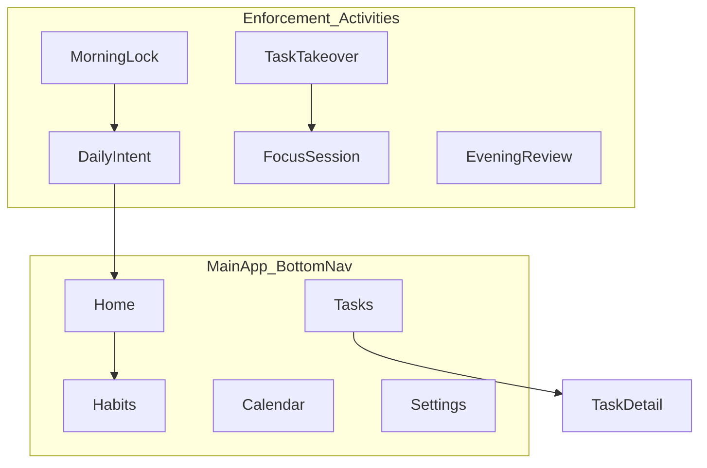

# Screen Inventory

All screens use dark theme per [design-system.md](design-system.md). Navigation via bottom bar (main app) or full-screen `Activity` (enforcement).

## Navigation map

---

## 1. Home

**Route:** `home`

| Area | Content |
|------|---------|
| Top | Date, greeting ("Tuesday, May 18") |
| Card | Morning status: locked / intent done / unlocked |
| Card | Today's Top 3 (if set) with completion state |
| Section | Mini habit grid (current week, 3–7 columns visible) |
| Section | Next scheduled task + time |
| FAB | Quick add task (optional Phase 1) |

**Actions:** Tap habit mini-grid → Habits; tap task → Task detail.

---

## 2. Habits (full grid)

**Route:** `habits`

| Area | Content |
|------|---------|
| Top bar | Title "Habits", add habit icon |
| Body | Full `HabitGrid` (week navigation arrows) |
| Bottom | Week range label |

**Actions:** Tap cell toggle; add habit dialog; edit habit from row menu.

---

## 3. Tasks list

**Route:** `tasks`

| Area | Content |
|------|---------|
| Top bar | Title "Tasks", filter chips (All / Today / Done) |
| List | `TaskRow` items sorted by `scheduledAt` then priority |
| FAB | New task |

---

## 4. Task detail

**Route:** `tasks/{id}`

| Field | UI |
|-------|-----|
| Title | Editable text field |
| Notes | Multiline |
| Scheduled | Date + time picker |
| Duration | Stepper (minutes) |
| Priority | Segmented control |
| Status | Chip group |
| Actions | Save, Delete |

---

## 5. Calendar (day view)

**Route:** `calendar`

| Area | Content |
|------|---------|
| Top | Date picker / day strip |
| Timeline | Hour slots 6:00–22:00 |
| Blocks | `CalendarEvent` cards, color `surfaceVariant` |
| Tap slot | Create event or link task |

Week view deferred to post-Phase 1.

---

## 6. Morning lock (Phase 2)

**Activity:** `MorningLockActivity` (full-screen, overlay)

| Area | Content |
|------|---------|
| Background | `overlayScrim` |
| Center | "Scan bathroom tag to start your day" |
| Illustration | NFC icon pulse animation (subtle) |
| Footer | No skip button in production |

Blocks all other interaction until NFC success.

---

## 7. Daily intent (Phase 2)

**Route/Activity:** after NFC → `DailyIntentScreen`

| Step | Content |
|------|---------|
| 1 | "Pick your Top 3 frogs" — three `Top3IntentCard` slots |
| 2 | "Block your calendar" — assign time blocks for each (creates/updates events) |
| CTA | "Unlock my day" (enabled when 3 tasks + blocks set) |

On submit: persist `DailyIntent`, write `LifeLog`, dismiss lock.

---

## 8. Focus session (Phase 3)

**Activity:** `FocusSessionActivity`

| Area | Content |
|------|---------|
| Center | Monospace countdown |
| Subtitle | Task title |
| Bottom | Pause (discouraged), Complete early |

Foreground notification while running.

---

## 9. Task takeover (Phase 3)

**Activity:** `TaskTakeoverActivity`

| Area | Content |
|------|---------|
| Full screen | `FullScreenTakeover` component |
| Alarm | Repeats every 2 min until action |

Actions: Start Focus → Focus session; Snooze (max 2×, 5 min).

---

## 10. Evening review (Phase 2)

**Route:** `evening-review` (also prompt at configured time)

| Area | Content |
|------|---------|
| Form | `EveningReviewForm` |
| Grid | Read-only week snapshot |
| CTA | "Close the day" |

Triggers sync push on save.

---

## 11. Settings

**Route:** `settings`

| Section | Items |
|---------|-------|
| Account | API base URL, API key (masked), Test connection |
| Morning | NFC tag enrollment ("Register tag"), wake time |
| Permissions | Overlay, exact alarm, NFC, notifications — each with status + link to system settings |
| Sync | Last sync time, Sync now |
| About | Version, docs link |

---

## Bottom navigation (main app)

| Tab | Icon | Route |
|-----|------|-------|
| Home | home | `home` |
| Habits | grid_view | `habits` |
| Tasks | check_circle | `tasks` |
| Calendar | calendar_today | `calendar` |
| Settings | settings | `settings` |

## Related

- [user-flows.md](user-flows.md)
- [design-system.md](design-system.md)
