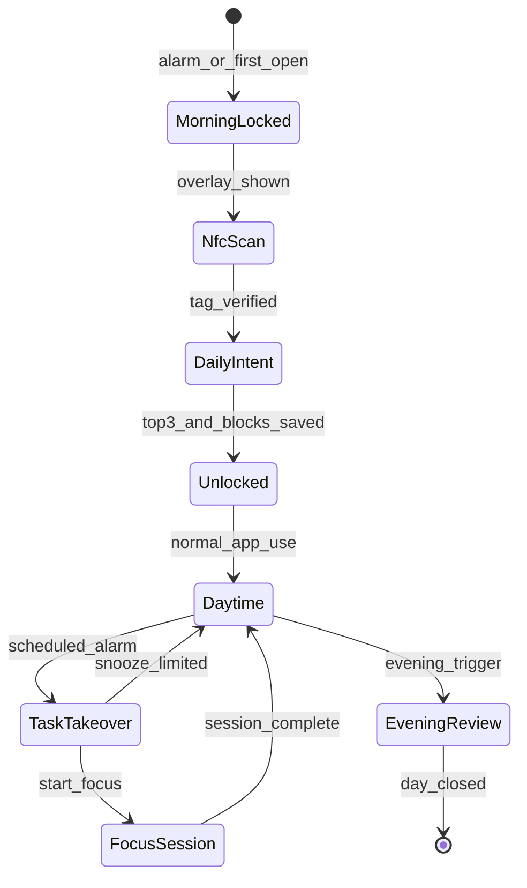
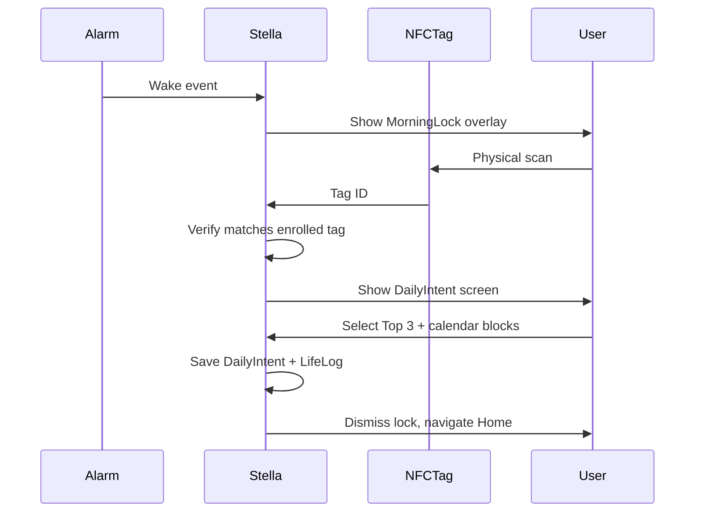
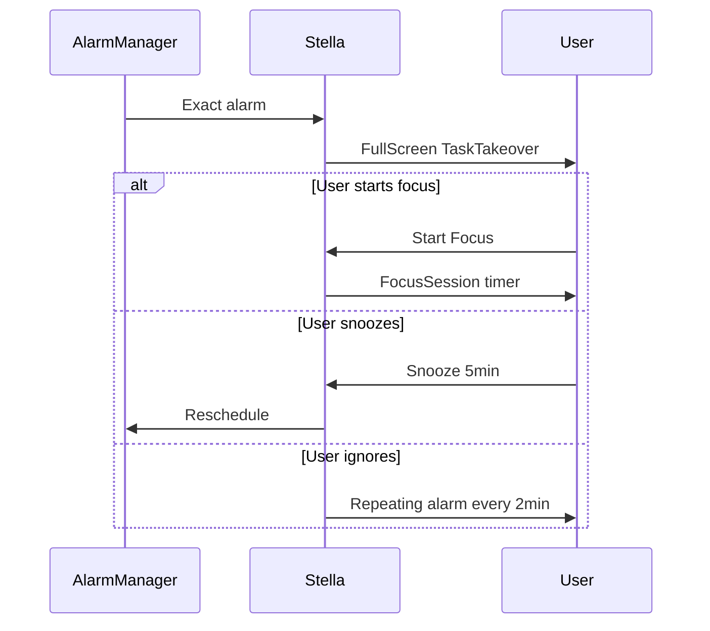
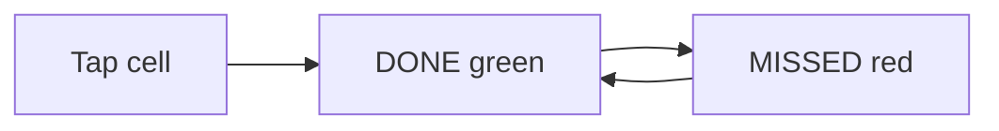
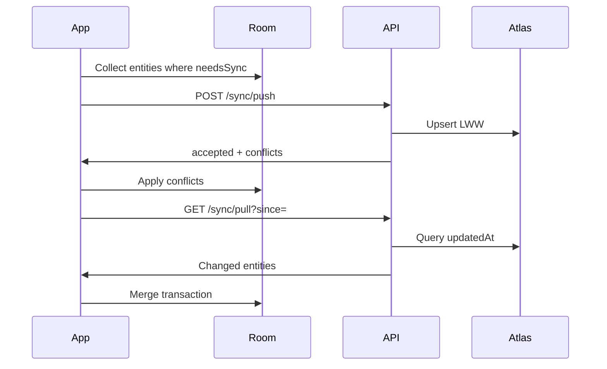

# User Flows

End-to-end flows for Stella's aggressive accountability loops.

## Daily lifecycle overview

---

## Flow 1: Morning hostage (Phase 2)

**Trigger:** Alarm fires, or first app open after wake window (configurable in Settings).

### Rules

- Wrong tag → error toast, remain locked
- No enrolled tag → Settings blocks enrollment first-run wizard
- **No production manual bypass** (debug builds may expose dev menu — not documented for release)

### Data written

- `DailyIntent` record
- `LifeLog` type `MORNING_UNLOCK`
- Optional `CalendarEvent` blocks for Top 3

---

## Flow 2: Daytime task enforcement (Phase 3)

**Trigger:** `Task.scheduledAt` reached.

### Snooze policy

- Max 2 snoozes per task per day
- After max: only "Start Focus" or "Mark Skipped" (skipped writes `LifeLog`)

---

## Flow 3: Habit check-in (Phase 1)

**Context:** User opens Habits tab or evening review.

1. User taps grid cell for today.
2. Toggle: unchecked → `DONE` (green); tap again → `MISSED` (red).
3. Past days without check-in auto-marked `MISSED` at local midnight (WorkManager job).

---

## Flow 4: Evening review (Phase 2)

**Trigger:** Local notification at configured time (e.g. 20:30) or user opens from Home banner.

1. Show `EveningReview` screen with form + grid snapshot.
2. User fills planned vs actual + reflection.
3. User confirms habit states in embedded grid (read-only or final edits).
4. Tap "Close the day".
5. Persist `EveningReview`, append `LifeLog`, trigger sync push.

**Gate:** Cannot mark day "closed" twice; second open is read-only view.

---

## Flow 5: Sync (Phase 1)

**Trigger:** Foreground, manual, periodic, post-evening-review.

---

## Flow 6: First-time setup

1. Install app → Welcome screen.
2. Settings: enter API URL + API key → Test connection.
3. Permissions checklist (overlay, alarms, NFC, notifications).
4. Enroll NFC tag in bathroom.
5. Create first habits (or pull from server if reinstall).
6. Set wake time + evening review time.

---

## Edge cases

| Scenario | Behavior |
|----------|----------|
| Phone reboot during focus | Restore timer from Room if session active |
| NFC tag lost | Re-enroll in Settings; old tag invalidated |
| No network for days | Full local function; sync backlog on reconnect |
| Task scheduled in past | Show takeover immediately on next open |
| User force-stops app | Alarms may not fire until reopened — document in Settings |

## Related

- [screens.md](screens.md)
- [../android/permissions-and-apis.md](../android/permissions-and-apis.md)
- [../implementation-roadmap.md](../implementation-roadmap.md)
