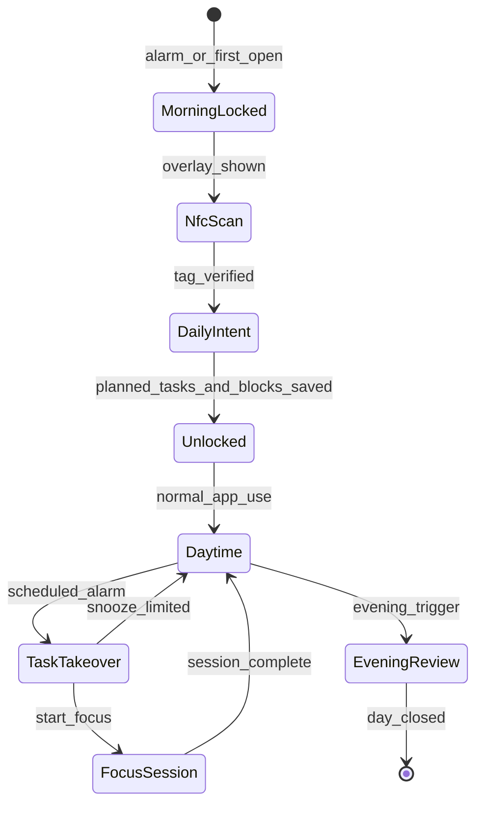
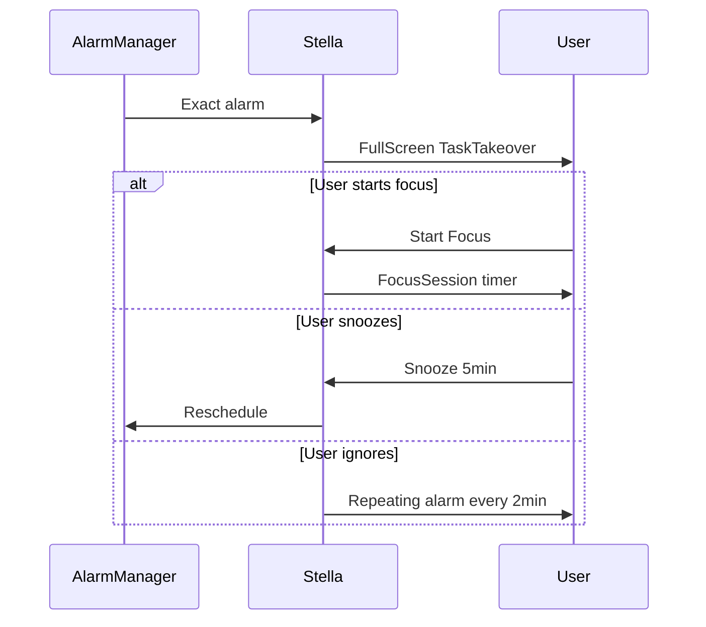
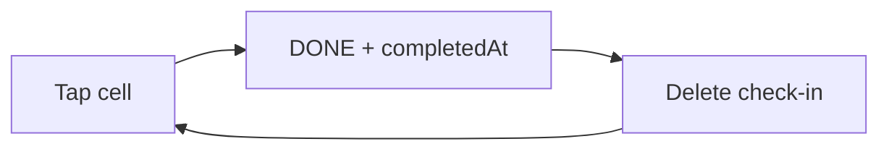
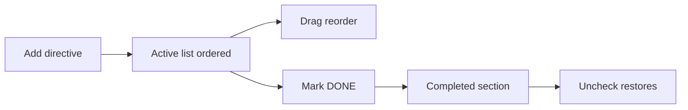
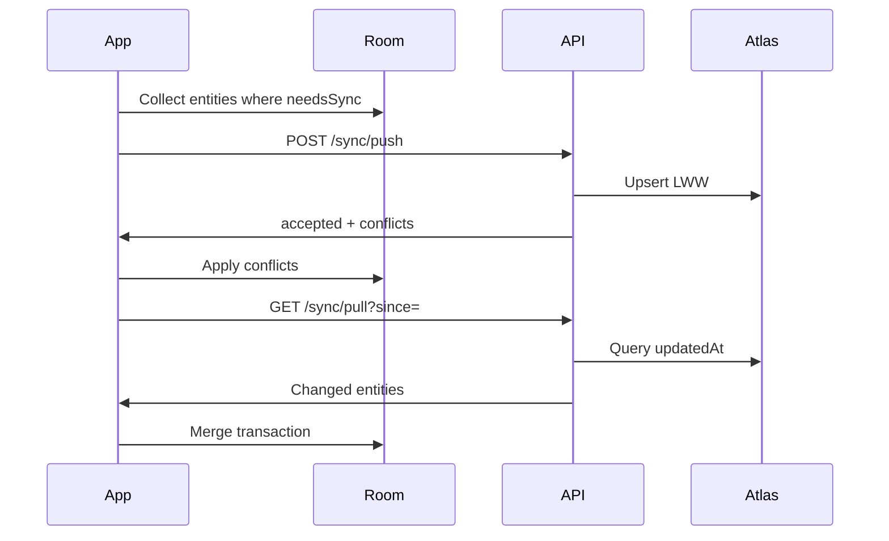

# User Flows

End-to-end flows for Stella's aggressive accountability loops.

## Daily lifecycle overview



---

## Flow 1: Morning hostage (Phase 2)

**Trigger:** `MorningAlarmScheduler` at configured wake time, or opening Stella before daily intent is complete.

```mermaid
sequenceDiagram
  participant Alarm
  participant Stella
  participant NFC as NFCTag
  participant User

  Alarm->>Stella: MorningAlarmReceiver
  Stella->>User: FSI + MorningLockActivity + enforcement FGS
  Stella->>User: Overlay if user leaves app while unlocked
  User->>NFC: Physical scan
  NFC->>Stella: Tag ID
  Stella->>Stella: Verify matches enrolled tag
  Stella->>User: Show DailyIntent screen
  User->>Stella: Build today's plan (3+ tasks via search/list; optional per-task times in info sheet)
  Stella->>Stella: Save DailyIntent + LifeLog
  Stella->>User: Dismiss lock, navigate Home
```

### Rules

- Wrong tag → inline error message on overlay, remain locked
- No enrolled tag → Developer Options prompts NFC enrollment before morning unlock works
- **No production manual bypass** (debug builds may expose dev menu — not documented for release)

### Data written

- `DailyIntent` record
- `LifeLog` type `MORNING_UNLOCK`
- `CalendarEvent` blocks for all planned tasks (times from info sheet / Settings defaults)

---

## Flow 2: Daytime task enforcement (Phase 3)

**Trigger:** `Task.scheduledAt` reached.



### Snooze policy

- Max 2 snoozes per task per day
- After max: only "Start Focus" or "Mark Skipped" (skipped writes `LifeLog`)

---

## Flow 3: Habit check-in (Phase 1)

**Context:** User opens Habits (Discipline) or evening review.

1. Week view shows Mon–Sun (`M T W T F S S`); chevrons change week range.
2. Tap cell → `DONE` with `completedAt` timestamp (emerald cell + check).
3. Tap again → delete check-in (incomplete grey cell).
4. Long-press completed cell → tooltip with local completion time.
5. `+` → create habit sheet; tap habit name → rename/delete sheet.



---

## Flow 3b: Frontline directives

**Context:** User opens Frontline (Operations) from drawer or Control Center.

1. Tap collapsed **New directive** → expand composer.
2. Enter title; tap **Today** or **Tomorrow** → schedule sheet (pick time; date preset; change day via chevrons).
3. Confirm **Add directive** → task appears in active list with sequence badge and time chip.
4. Tap card body → edit sheet (name, date/time); drag handle reorders (persists on release).
5. Checkbox cycles TODO → IN_PROGRESS → DONE; DONE moves to **Completed** section.
6. Uncheck from Completed restores task to end of active sequence.



---

## Flow 4: Temporal Grid

**Context:** User opens Calendar from drawer (Temporal category).

1. View monthly grid with status dots (completions vs scheduled events).
2. Tap a day → day bottom sheet lists completed habits/tasks and scheduled events.
3. Tap **Add event** or a scheduled row → event editor (title, start/end, repeat, reminders).
4. Save → `CalendarEvent` persisted locally, sync push, WorkManager reminders scheduled.
5. Yearly/custom repeat expands occurrences in the month grid (master-series edit in v1).

---

## Flow 5: Evening review (Phase 2)

**Trigger:** Local notification at configured time (e.g. 20:30) or user opens from Home banner.

1. Show `EveningReview` screen with form + grid snapshot.
2. User fills planned vs actual + reflection.
3. User confirms habit states in embedded grid (read-only or final edits).
4. Tap "Close the day".
5. Persist `EveningReview`, append `LifeLog`, trigger sync push.

**Gate:** Cannot mark day "closed" twice; second open is read-only view.

---

## Flow 6: Sync (Phase 1)

**Trigger:** Foreground, manual, periodic, post-evening-review.



---

## Flow 6: First-time setup

1. Install app → Welcome screen.
2. Settings → **Developer Options**: enter API URL + API key → Save credentials. Diagnostics → **Ping API Connection**.
3. Permissions checklist (overlay, alarms, NFC, notifications).
4. Enroll NFC tag in bathroom.
5. Create first habits (or pull from server if reinstall).
6. Set wake time + evening review time.

---

## Edge cases

| Scenario | Behavior |
|----------|----------|
| Phone reboot during focus | Restore timer from Room if session active |
| NFC tag lost | Re-enroll in Settings; old tag invalidated |
| No network for days | Full local function; sync backlog on reconnect |
| Task scheduled in past | Show takeover immediately on next open |
| User force-stops app | Alarms may not fire until reopened — document in Settings |

## Related

- [screens.md](screens.md)
- [../android/permissions-and-apis.md](../android/permissions-and-apis.md)
- [../implementation-roadmap.md](../implementation-roadmap.md)
